# Diagramma ER — Gestionale Le Gole

```mermaid
erDiagram
    UTENTE {
        uuid id PK
        string username UK
        string email
        string password
        boolean is_staff
        boolean is_superuser
        boolean is_active
    }

    CLIENTE {
        uuid id PK
        string nome
        string telefono
        datetime created_at
        datetime updated_at
    }

    %% --- Area Piscina (app struttura + prenotazioni) ---

    PISCINA_INVENTARIO {
        uuid id PK
        string nome
        string descrizione
        decimal prezzo_ingresso
        decimal prezzo_ingresso_ridotto
        decimal prezzo_ingresso_bambino
        decimal prezzo_ombrellone
        decimal prezzo_gazebo
        decimal prezzo_lettino
        decimal prezzo_sdraia
        int totale_ombrelloni
        int totale_gazebi
        int totale_lettini
        int totale_sdraie
        time orario_apertura
        time orario_chiusura
        time orario_inizio_ridotto
        int eta_minima_bambino
        int eta_massima_bambino
        boolean isActive
        datetime created_at
        datetime updated_at
    }

    POSTAZIONE {
        uuid id PK
        uuid inventario_id FK
        string tipo
        int numero
        float pos_x
        float pos_y
        uuid gruppo
        datetime deleted_at
        datetime created_at
        datetime updated_at
    }

    PRENOTAZIONE_PISCINA {
        uuid id PK
        uuid cliente_id FK
        uuid inventario_id FK
        date data
        time ora
        string stato
        string note
        int ingressi
        int ingressi_ridotti
        int ingressi_bambini
        int ingressi_gratuiti
        int ombrellone
        int gazebo
        int lettino
        int sdraia
        boolean creata_da_staff
        datetime created_at
        datetime updated_at
    }

    GIORNO_PIENO_PISCINA {
        uuid id PK
        uuid inventario_id FK
        date data
        string note
        datetime created_at
    }

    OCCUPAZIONE_POSTAZIONE {
        uuid id PK
        uuid postazione_id FK
        uuid prenotazione_id FK
        date data
        string cliente_nome
        int numero_lettini
        int numero_sdraie
        time orario_arrivo_previsto
        boolean arrivato
        datetime created_at
        datetime updated_at
    }

    POSTAZIONE_POSIZIONE_STORICO {
        uuid id PK
        uuid postazione_id FK
        date data
        float pos_x
        float pos_y
        datetime created_at
    }

    %% --- Area Asporto (app menu + prenotazioni) ---

    CATEGORIA {
        uuid id PK
        string nome UK
        datetime created_at
    }

    ALLERGENE {
        uuid id PK
        string nome UK
        string icona
        datetime created_at
    }

    PRODOTTO {
        uuid id PK
        uuid categoria_id FK
        string nome
        string descrizione
        decimal prezzo
        boolean disponibile
        string immagine
        datetime created_at
        datetime updated_at
    }

    CONFIGURAZIONE_ASPORTO {
        uuid id PK "singleton"
        boolean attivo
        time orario_apertura
        time orario_chiusura
        time orario_apertura_2
        time orario_chiusura_2
        int limite_prenotazioni_orario
        datetime updated_at
    }

    GIORNO_CHIUSO_ASPORTO {
        uuid id PK
        date data UK
        datetime created_at
    }

    PRENOTAZIONE_ASPORTO {
        uuid id PK
        uuid cliente_id FK
        date data
        time ora
        string stato
        string note
        boolean creata_da_staff
        datetime created_at
        datetime updated_at
    }

    VOCE_ORDINE {
        uuid id PK
        uuid prenotazione_id FK
        uuid prodotto_id FK
        int quantita
        decimal prezzo_unitario
        string note
    }

    %% --- Area Padel (app struttura + prenotazioni) ---

    CONFIGURAZIONE_PADEL {
        uuid id PK "singleton"
        boolean attivo
        time orario_apertura
        time orario_chiusura
        int durata_partita_minuti
        decimal prezzo_partita
        int max_partecipanti
        decimal prezzo_noleggio_palline
        datetime updated_at
    }

    GIORNO_CHIUSO_PADEL {
        uuid id PK
        date data UK
        datetime created_at
    }

    RACCHETTA_PADEL {
        uuid id PK
        string nome UK
        decimal prezzo_noleggio
        int quantita_disponibile
        boolean disponibile
        datetime created_at
        datetime updated_at
    }

    PRENOTAZIONE_PADEL {
        uuid id PK
        uuid cliente_id FK
        date data
        time ora
        string stato
        string note
        int partecipanti
        boolean palline_noleggiate
        int durata_minuti
        decimal prezzo_partita
        decimal prezzo_palline
        boolean creata_da_staff
        datetime created_at
        datetime updated_at
    }

    NOLEGGIO_RACCHETTA {
        uuid id PK
        uuid prenotazione_id FK
        uuid racchetta_id FK
        int quantita
        decimal prezzo_unitario
        datetime created_at
        datetime updated_at
    }

    CLIENTE ||--o{ PRENOTAZIONE_PISCINA : "effettua (CASCADE)"
    PISCINA_INVENTARIO ||--o{ POSTAZIONE : "contiene (CASCADE)"
    PISCINA_INVENTARIO ||--o{ PRENOTAZIONE_PISCINA : "riguarda (PROTECT)"
    PISCINA_INVENTARIO ||--o{ GIORNO_PIENO_PISCINA : "marca pieno (CASCADE)"
    POSTAZIONE ||--o{ OCCUPAZIONE_POSTAZIONE : "occupata in (CASCADE)"
    POSTAZIONE ||--o{ POSTAZIONE_POSIZIONE_STORICO : "storicizza (CASCADE)"
    PRENOTAZIONE_PISCINA |o--o{ OCCUPAZIONE_POSTAZIONE : "collegata a (SET_NULL)"

    CATEGORIA ||--o{ PRODOTTO : "raggruppa (PROTECT)"
    PRODOTTO }o--o{ ALLERGENE : "contiene"
    PRODOTTO ||--o{ VOCE_ORDINE : "ordinato in (PROTECT)"
    CLIENTE ||--o{ PRENOTAZIONE_ASPORTO : "effettua (CASCADE)"
    PRENOTAZIONE_ASPORTO ||--o{ VOCE_ORDINE : "contiene (CASCADE)"

    CLIENTE ||--o{ PRENOTAZIONE_PADEL : "effettua (CASCADE)"
    PRENOTAZIONE_PADEL ||--o{ NOLEGGIO_RACCHETTA : "contiene (CASCADE)"
    RACCHETTA_PADEL ||--o{ NOLEGGIO_RACCHETTA : "noleggiata in (PROTECT)"
```

`CONFIGURAZIONE_ASPORTO` e `CONFIGURAZIONE_PADEL` sono righe **singleton** (una sola riga condivisa, su un `pk` fisso noto in anticipo, tramite `get_or_create`) — nessuna relazione in ingresso/uscita, non un "listino" per-oggetto come `PISCINA_INVENTARIO`.

## Vincoli composti

| Tabella | Vincolo |
|---|---|
| `POSTAZIONE` | `UNIQUE(inventario_id, numero) WHERE deleted_at IS NULL` |
| `OCCUPAZIONE_POSTAZIONE` | `UNIQUE(postazione_id, data)` |
| `GIORNO_PIENO_PISCINA` | `UNIQUE(inventario_id, data)` |
| `POSTAZIONE_POSIZIONE_STORICO` | `UNIQUE(postazione_id, data)` |
| `CATEGORIA.nome` | `UNIQUE` |
| `ALLERGENE.nome` | `UNIQUE` |
| `GIORNO_CHIUSO_ASPORTO.data` | `UNIQUE` |
| `GIORNO_CHIUSO_PADEL.data` | `UNIQUE` |
| `RACCHETTA_PADEL.nome` | `UNIQUE` |
| `NOLEGGIO_RACCHETTA` | `UNIQUE(prenotazione_id, racchetta_id)` — una sola riga per marca per prenotazione, quantità multiple aggregate sulla stessa riga |
| `CLIENTE.telefono` | solo applicativo (`get_or_create`) |
| `UTENTE.email` | solo applicativo (`email__iexact`) |

## Comportamento `ON DELETE`

| Foreign key | `on_delete` |
|---|---|
| `POSTAZIONE.inventario_id` → `PISCINA_INVENTARIO.id` | `CASCADE` |
| `PRENOTAZIONE_PISCINA.inventario_id` → `PISCINA_INVENTARIO.id` | `PROTECT` |
| `PRENOTAZIONE_PISCINA.cliente_id` → `CLIENTE.id` | `CASCADE` |
| `GIORNO_PIENO_PISCINA.inventario_id` → `PISCINA_INVENTARIO.id` | `CASCADE` |
| `OCCUPAZIONE_POSTAZIONE.postazione_id` → `POSTAZIONE.id` | `CASCADE` |
| `OCCUPAZIONE_POSTAZIONE.prenotazione_id` → `PRENOTAZIONE_PISCINA.id` | `SET_NULL` |
| `POSTAZIONE_POSIZIONE_STORICO.postazione_id` → `POSTAZIONE.id` | `CASCADE` |
| `PRODOTTO.categoria_id` → `CATEGORIA.id` | `PROTECT` |
| `VOCE_ORDINE.prodotto_id` → `PRODOTTO.id` | `PROTECT` |
| `VOCE_ORDINE.prenotazione_id` → `PRENOTAZIONE_ASPORTO.id` | `CASCADE` |
| `PRENOTAZIONE_ASPORTO.cliente_id` → `CLIENTE.id` | `CASCADE` |
| `NOLEGGIO_RACCHETTA.racchetta_id` → `RACCHETTA_PADEL.id` | `PROTECT` |
| `NOLEGGIO_RACCHETTA.prenotazione_id` → `PRENOTAZIONE_PADEL.id` | `CASCADE` |
| `PRENOTAZIONE_PADEL.cliente_id` → `CLIENTE.id` | `CASCADE` |

Note:
- `PRODOTTO` ↔ `ALLERGENE` è una `ManyToManyField` (tabella ponte implicita, gestita da Django): eliminare un `Allergene` scollega semplicemente i prodotti che lo referenziavano, nessun `on_delete` da specificare su quel lato.
- `VOCE_ORDINE`/`NOLEGGIO_RACCHETTA` seguono lo stesso schema (`PROTECT` verso il catalogo, `CASCADE` verso la prenotazione che le contiene): un prodotto/una racchetta con storico non è eliminabile, ma eliminare una prenotazione elimina a cascata le proprie righe.
- `VOCE_ORDINE.prezzo_unitario` e i quattro campi snapshot di `PRENOTAZIONE_PADEL` (`durata_minuti`, `prezzo_partita`, `prezzo_palline`) — più `prezzo_unitario` su `NOLEGGIO_RACCHETTA` — sono copiati al momento della creazione dalla configurazione/dal catalogo corrente, mai ricalcolati: un cambio di prezzo successivo non altera retroattivamente lo storico.
