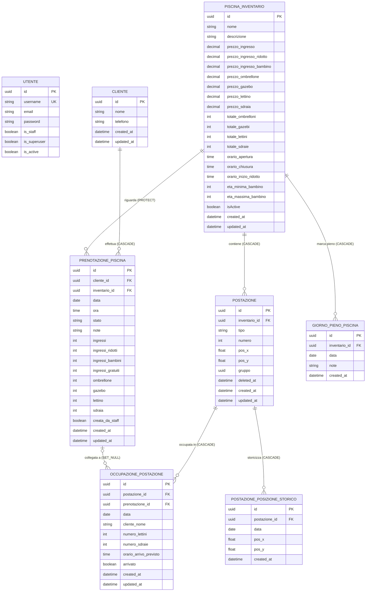

# Diagramma ER — Gestionale Le Gole

## Vincoli composti

| Tabella | Vincolo |
|---|---|
| `POSTAZIONE` | `UNIQUE(inventario_id, numero) WHERE deleted_at IS NULL` |
| `OCCUPAZIONE_POSTAZIONE` | `UNIQUE(postazione_id, data)` |
| `GIORNO_PIENO_PISCINA` | `UNIQUE(inventario_id, data)` |
| `POSTAZIONE_POSIZIONE_STORICO` | `UNIQUE(postazione_id, data)` |
| `CLIENTE.telefono` | solo applicativo (`get_or_create`) |
| `UTENTE.email` | solo applicativo (`email__iexact`) |

## Comportamento `ON DELETE`

| Foreign key | `on_delete` |
|---|---|
| `POSTAZIONE.inventario_id` → `PISCINA_INVENTARIO.id` | `CASCADE` |
| `PRENOTAZIONE_PISCINA.inventario_id` → `PISCINA_INVENTARIO.id` | `PROTECT` |
| `PRENOTAZIONE_PISCINA.cliente_id` → `CLIENTE.id` | `CASCADE` |
| `GIORNO_PIENO_PISCINA.inventario_id` → `PISCINA_INVENTARIO.id` | `CASCADE` |
| `OCCUPAZIONE_POSTAZIONE.postazione_id` → `POSTAZIONE.id` | `CASCADE` |
| `OCCUPAZIONE_POSTAZIONE.prenotazione_id` → `PRENOTAZIONE_PISCINA.id` | `SET_NULL` |
| `POSTAZIONE_POSIZIONE_STORICO.postazione_id` → `POSTAZIONE.id` | `CASCADE` |
