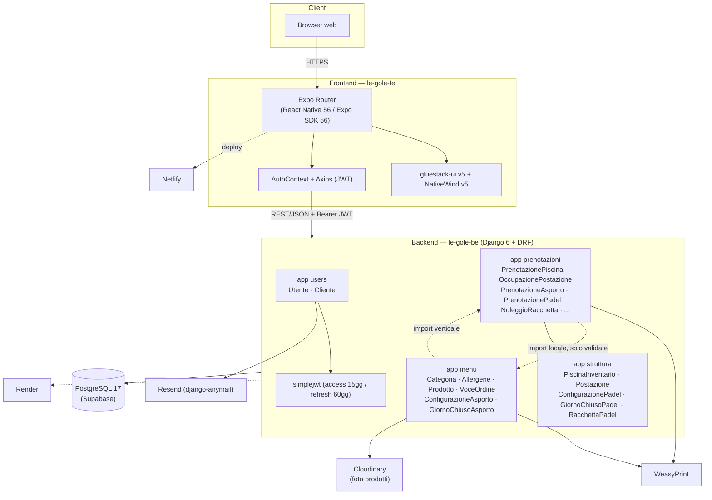
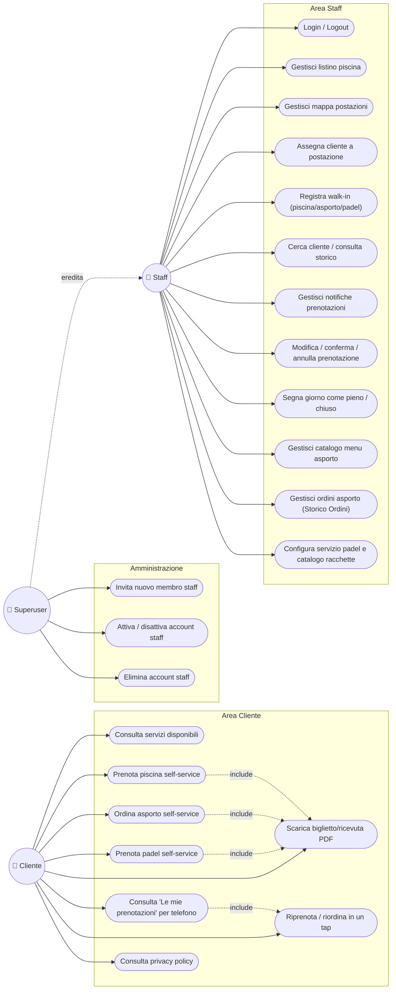
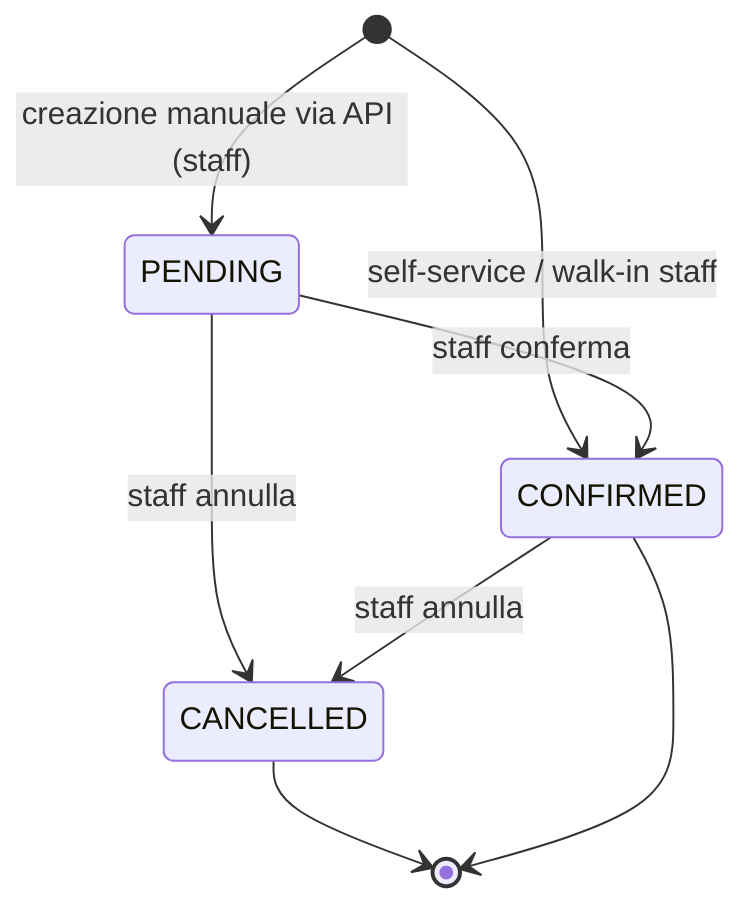
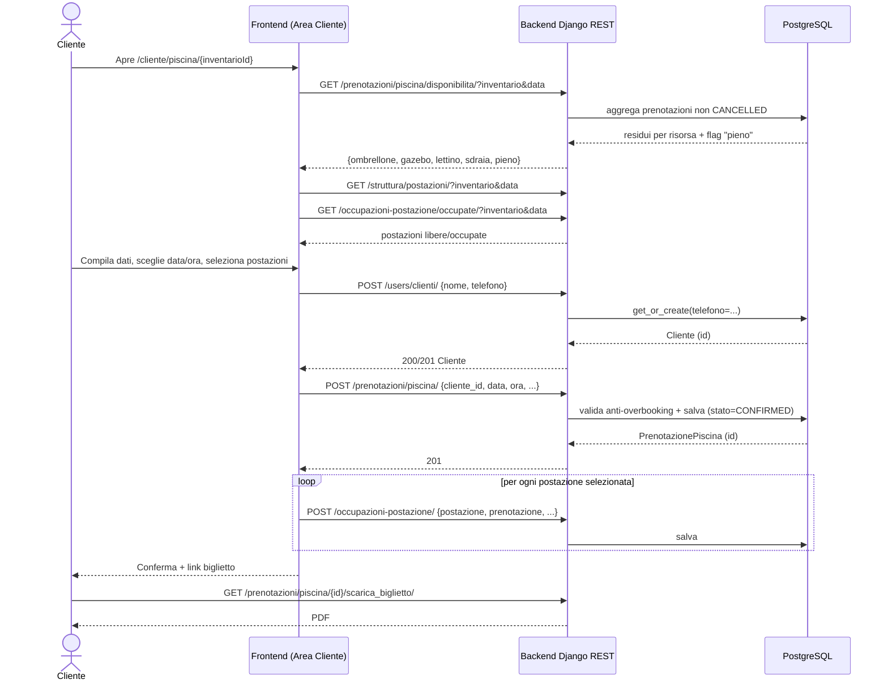
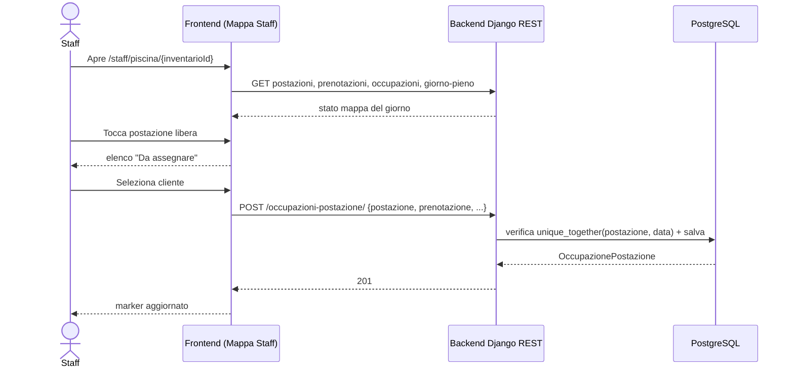
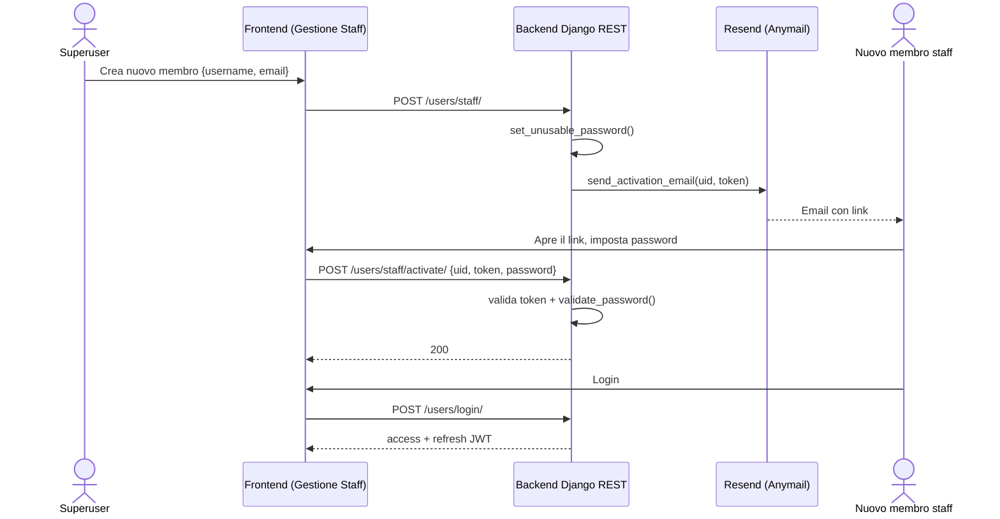
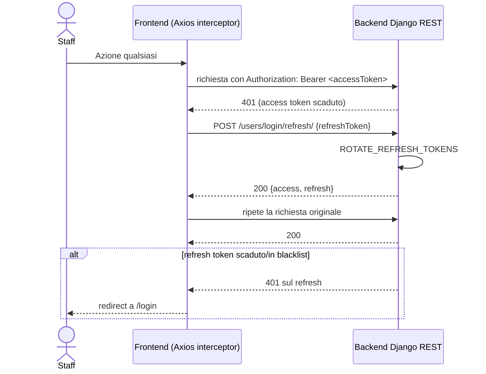
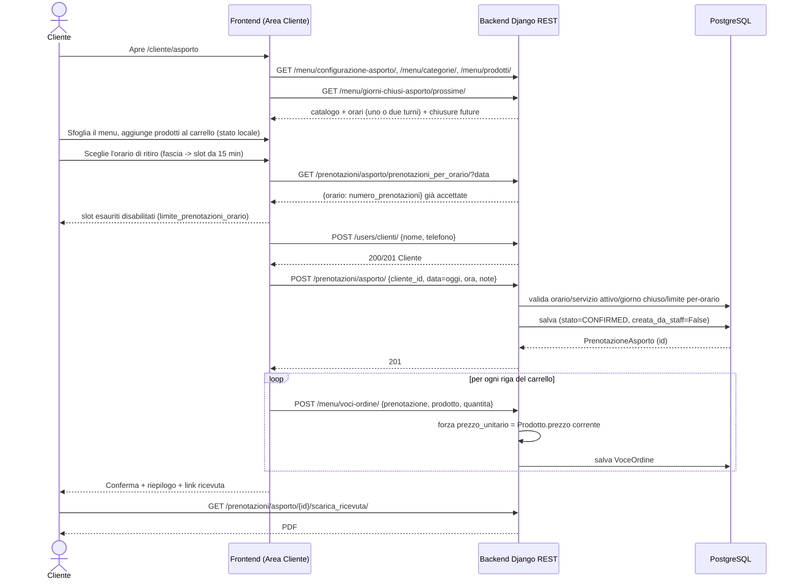
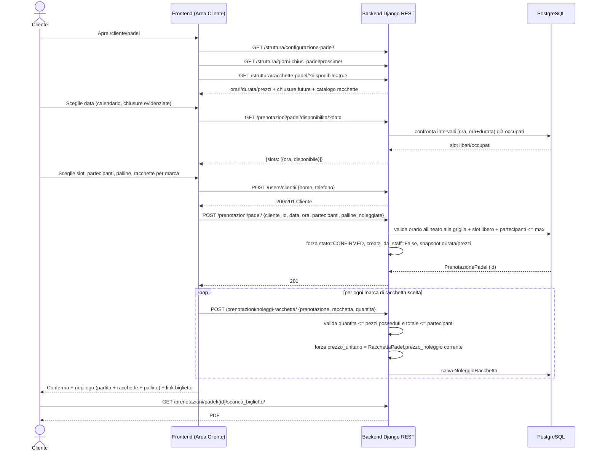

# Documentazione UML — Gestionale Le Gole

## Indice

1. [Panoramica architetturale](#1-panoramica-architetturale)
2. [Diagramma dei casi d'uso](#2-diagramma-dei-casi-duso)
3. [Diagramma delle classi — dominio applicativo](#3-diagramma-delle-classi--dominio-applicativo)
4. [Diagramma di stato — ciclo di vita `Prenotazione`](#4-diagramma-di-stato--ciclo-di-vita-prenotazione)
5. [Diagrammi di sequenza](#5-diagrammi-di-sequenza)
   - [5.1 Prenotazione self-service piscina (Area Cliente)](#51-prenotazione-self-service-piscina-area-cliente)
   - [5.2 Assegnazione postazione dalla mappa staff](#52-assegnazione-postazione-dalla-mappa-staff)
   - [5.3 Invito e attivazione account staff](#53-invito-e-attivazione-account-staff)
   - [5.4 Refresh automatico del token JWT](#54-refresh-automatico-del-token-jwt)
   - [5.5 Checkout self-service asporto (Area Cliente)](#55-checkout-self-service-asporto-area-cliente)
   - [5.6 Prenotazione self-service padel con noleggio racchette](#56-prenotazione-self-service-padel-con-noleggio-racchette)
6. [Moduli futuri](#6-moduli-futuri)

---

## 1. Panoramica architetturale

`app menu` importa `PrenotazioneAsporto` da `app prenotazioni` a livello di modulo (dipendenza a senso unico); l'unica eccezione è `PrenotazioneAsportoSerializer.validate()`, che importa `ConfigurazioneAsporto`/`GiornoChiusoAsporto` da `menu` con un import **locale alla funzione**, per non rendere la dipendenza incrociata strutturale. `ConfigurazionePadel`/`GiornoChiusoPadel`/`RacchettaPadel` vivono invece in `struttura` (non in una nuova app dedicata) proprio per evitare lo stesso problema: `prenotazioni` importa già `struttura` a livello di modulo, quindi `PrenotazionePadelSerializer` può leggerli senza alcun import locale.

---

## 2. Diagramma dei casi d'uso

---

## 3. Diagramma delle classi — dominio applicativo

```mermaid
classDiagram
    direction LR

    class StatoPrenotazione {
        <<enumeration>>
        PENDING
        CONFIRMED
        CANCELLED
    }
    class TipoPostazione {
        <<enumeration>>
        OMBRELLONE
        GAZEBO
    }

    class Utente {
        <<AbstractUser>>
        +UUID id
        +string username
        +string email
        +string password
        +bool is_staff
        +bool is_superuser
        +bool is_active
    }

    class Cliente {
        +UUID id
        +string nome
        +string telefono
        +datetime created_at
        +datetime updated_at
    }

    class PiscinaInventario {
        +UUID id
        +string nome
        +string descrizione
        +decimal prezzo_ingresso
        +decimal prezzo_ingresso_ridotto
        +decimal prezzo_ingresso_bambino
        +decimal prezzo_ombrellone
        +decimal prezzo_gazebo
        +decimal prezzo_lettino
        +decimal prezzo_sdraia
        +int totale_ombrelloni
        +int totale_gazebi
        +int totale_lettini
        +int totale_sdraie
        +time orario_apertura
        +time orario_chiusura
        +time orario_inizio_ridotto
        +int eta_minima_bambino
        +int eta_massima_bambino
        +bool isActive
        +datetime created_at
        +datetime updated_at
    }

    class Postazione {
        +UUID id
        +int numero
        +float pos_x
        +float pos_y
        +UUID gruppo
        +datetime deleted_at
        +datetime created_at
        +datetime updated_at
    }

    class Prenotazione {
        <<abstract>>
        +UUID id
        +date data
        +time ora
        +string note
        +datetime created_at
        +datetime updated_at
    }

    class PrenotazionePiscina {
        +int ingressi
        +int ingressi_ridotti
        +int ingressi_bambini
        +int ingressi_gratuiti
        +int ombrellone
        +int gazebo
        +int lettino
        +int sdraia
        +bool creata_da_staff
    }

    class GiornoPienoPiscina {
        +UUID id
        +date data
        +string note
        +datetime created_at
    }

    class OccupazionePostazione {
        +UUID id
        +date data
        +string cliente_nome
        +int numero_lettini
        +int numero_sdraie
        +time orario_arrivo_previsto
        +bool arrivato
        +datetime created_at
        +datetime updated_at
    }

    class PostazionePosizioneStorico {
        +UUID id
        +date data
        +float pos_x
        +float pos_y
        +datetime created_at
    }

    class Categoria {
        +UUID id
        +string nome
        +datetime created_at
    }

    class Allergene {
        +UUID id
        +string nome
        +string icona
        +datetime created_at
    }

    class Prodotto {
        +UUID id
        +string nome
        +string descrizione
        +decimal prezzo
        +bool disponibile
        +ImageField immagine
        +datetime created_at
        +datetime updated_at
    }

    class ConfigurazioneAsporto {
        <<singleton>>
        +UUID id
        +bool attivo
        +time orario_apertura
        +time orario_chiusura
        +time orario_apertura_2
        +time orario_chiusura_2
        +int limite_prenotazioni_orario
        +datetime updated_at
        +get_solo() ConfigurazioneAsporto
        +orario_valido(ora) bool
        +descrizione_orari() str
    }

    class GiornoChiusoAsporto {
        +UUID id
        +date data
        +datetime created_at
    }

    class PrenotazioneAsporto {
        +bool creata_da_staff
        +Decimal totale
    }

    class VoceOrdine {
        +UUID id
        +int quantita
        +decimal prezzo_unitario
        +string note
        +Decimal subtotale
    }

    class ConfigurazionePadel {
        <<singleton>>
        +UUID id
        +bool attivo
        +time orario_apertura
        +time orario_chiusura
        +int durata_partita_minuti
        +decimal prezzo_partita
        +int max_partecipanti
        +decimal prezzo_noleggio_palline
        +datetime updated_at
        +get_solo() ConfigurazionePadel
        +slot_disponibili() list~time~
        +orario_valido(ora) bool
    }

    class GiornoChiusoPadel {
        +UUID id
        +date data
        +datetime created_at
    }

    class RacchettaPadel {
        +UUID id
        +string nome
        +decimal prezzo_noleggio
        +int quantita_disponibile
        +bool disponibile
        +datetime created_at
        +datetime updated_at
    }

    class PrenotazionePadel {
        +int partecipanti
        +bool palline_noleggiate
        +int durata_minuti
        +decimal prezzo_partita
        +decimal prezzo_palline
        +bool creata_da_staff
        +time orario_fine
        +Decimal totale
    }

    class NoleggioRacchetta {
        +UUID id
        +int quantita
        +decimal prezzo_unitario
        +datetime created_at
        +datetime updated_at
        +Decimal subtotale
    }

    Prenotazione <|-- PrenotazionePiscina
    Prenotazione <|-- PrenotazioneAsporto
    Prenotazione <|-- PrenotazionePadel

    Postazione ..> TipoPostazione
    PrenotazionePiscina ..> StatoPrenotazione
    PrenotazioneAsporto ..> StatoPrenotazione
    PrenotazionePadel ..> StatoPrenotazione

    Cliente "1" --> "0..*" PrenotazionePiscina : cliente_id (CASCADE)
    PiscinaInventario "1" --> "0..*" Postazione : inventario (CASCADE)
    PiscinaInventario "1" --> "0..*" PrenotazionePiscina : inventario (PROTECT)
    PiscinaInventario "1" --> "0..*" GiornoPienoPiscina : inventario (CASCADE)
    Postazione "1" --> "0..*" OccupazionePostazione : postazione (CASCADE)
    Postazione "1" --> "0..*" PostazionePosizioneStorico : postazione (CASCADE)
    PrenotazionePiscina "0..1" --> "0..*" OccupazionePostazione : prenotazione (SET_NULL)

    Categoria "1" --> "0..*" Prodotto : categoria (PROTECT)
    Prodotto "0..*" --> "0..*" Allergene : allergeni (M2M)
    Prodotto "1" --> "0..*" VoceOrdine : prodotto (PROTECT)
    Cliente "1" --> "0..*" PrenotazioneAsporto : cliente_id (CASCADE)
    PrenotazioneAsporto "1" --> "0..*" VoceOrdine : prenotazione (CASCADE)

    Cliente "1" --> "0..*" PrenotazionePadel : cliente_id (CASCADE)
    PrenotazionePadel "1" --> "0..*" NoleggioRacchetta : prenotazione (CASCADE)
    RacchettaPadel "1" --> "0..*" NoleggioRacchetta : racchetta (PROTECT)

    classDef users fill:#dbeafe,stroke:#1d4ed8,color:#1e3a8a
    classDef struttura fill:#dcfce7,stroke:#15803d,color:#14532d
    classDef prenotazioni fill:#fef3c7,stroke:#b45309,color:#78350f
    classDef menu fill:#ede9fe,stroke:#7c3aed,color:#4c1d95
    classDef padel fill:#cffafe,stroke:#0e7490,color:#164e63
    classDef enumStyle fill:#f3f4f6,stroke:#6b7280,color:#374151

    class Utente:::users
    class Cliente:::users
    class PiscinaInventario:::struttura
    class Postazione:::struttura
    class Prenotazione:::prenotazioni
    class PrenotazionePiscina:::prenotazioni
    class GiornoPienoPiscina:::prenotazioni
    class OccupazionePostazione:::prenotazioni
    class PostazionePosizioneStorico:::prenotazioni
    class Categoria:::menu
    class Allergene:::menu
    class Prodotto:::menu
    class ConfigurazioneAsporto:::menu
    class GiornoChiusoAsporto:::menu
    class VoceOrdine:::menu
    class PrenotazioneAsporto:::prenotazioni
    class ConfigurazionePadel:::padel
    class GiornoChiusoPadel:::padel
    class RacchettaPadel:::padel
    class PrenotazionePadel:::padel
    class NoleggioRacchetta:::padel
    class StatoPrenotazione:::enumStyle
    class TipoPostazione:::enumStyle
```

| Modello | Vincolo |
|---|---|
| `Postazione` | `UniqueConstraint(inventario, numero)` condizionato a `deleted_at IS NULL` |
| `OccupazionePostazione` | `unique_together(postazione, data)` |
| `GiornoPienoPiscina` | `unique_together(inventario, data)` |
| `PostazionePosizioneStorico` | `unique_together(postazione, data)` |
| `PrenotazionePiscina.inventario` | `on_delete=PROTECT` |
| `Categoria.nome` / `Allergene.nome` | unicità a livello di modello (`unique=True`) |
| `Prodotto.categoria` | `on_delete=PROTECT` |
| `VoceOrdine.prodotto` | `on_delete=PROTECT`; `VoceOrdine.prenotazione` | `on_delete=CASCADE` |
| `GiornoChiusoAsporto.data` / `GiornoChiusoPadel.data` | `unique=True` |
| `RacchettaPadel.nome` | `unique=True` |
| `NoleggioRacchetta` | `unique_together(prenotazione, racchetta)`; `racchetta` `PROTECT`, `prenotazione` `CASCADE` |
| `ConfigurazioneAsporto` / `ConfigurazionePadel` | singleton: una sola riga, `get_or_create(pk=<UUID fisso>)`, nessuna FK |
| `Cliente.telefono` | unicità solo applicativa (`get_or_create`) |
| `Utente.email` | unicità solo applicativa (`email__iexact`) |
| `Postazione.gruppo` | `UUIDField` non-FK, chiave di raggruppamento |

---

## 4. Diagramma di stato — ciclo di vita `Prenotazione`

Lo stesso `StatoPrenotazione` (`PENDING` / `CONFIRMED` / `CANCELLED`) e lo stesso ciclo di vita valgono per tutti e tre i modelli concreti che ereditano da `Prenotazione` — `PrenotazionePiscina`, `PrenotazioneAsporto`, `PrenotazionePadel`. In pratica lo stato `PENDING` non è più raggiungibile dal flusso self-service (nasce sempre `CONFIRMED`, sezione 1 di `CLAUDE.md`): resta possibile solo per una prenotazione creata via API direttamente da uno staff autenticato che lo scelga esplicitamente.

---

## 5. Diagrammi di sequenza

### 5.1 Prenotazione self-service piscina (Area Cliente)

### 5.2 Assegnazione postazione dalla mappa staff

### 5.3 Invito e attivazione account staff

### 5.4 Refresh automatico del token JWT

### 5.5 Checkout self-service asporto (Area Cliente)

### 5.6 Prenotazione self-service padel con noleggio racchette

---

## 6. Moduli futuri

| App | Modelli pianificati | Stato |
|---|---|---|
| `struttura` | `Sala`, `Tavolo` | 📋 Da sviluppare — nessun modello/API ancora definito |
| `prenotazioni` | `Prenotazione_Tavolo` | 📋 Da sviluppare |

`Prenotazione_Asporto` (app `prenotazioni`) e l'intero catalogo `menu` (`Categoria`/`Allergene`/`Prodotto`/`VoceOrdine`/`ConfigurazioneAsporto`/`GiornoChiusoAsporto`) sono **implementati** end-to-end (backend + staff + self-service cliente), così come l'intero dominio Padel (`struttura.ConfigurazionePadel`/`GiornoChiusoPadel`/`RacchettaPadel`, `prenotazioni.PrenotazionePadel`/`NoleggioRacchetta`) — entrambi rappresentati per intero nel diagramma delle classi (sezione 3). L'unico servizio ancora privo di qualunque modello/API backend è il **Ristorante** (`Sala`/`Tavolo`/`Prenotazione_Tavolo`).
