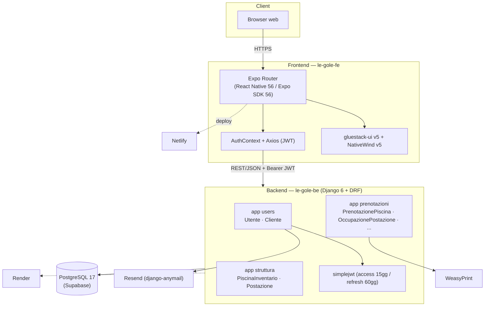
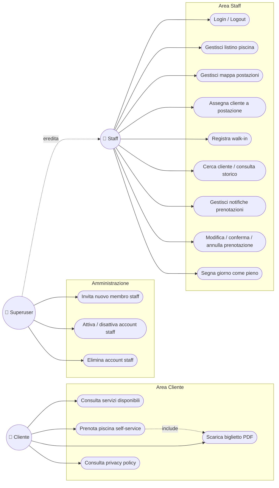
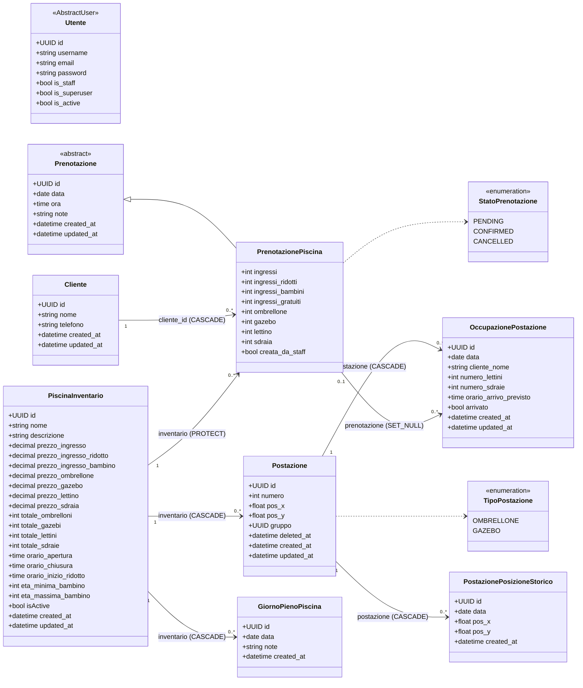
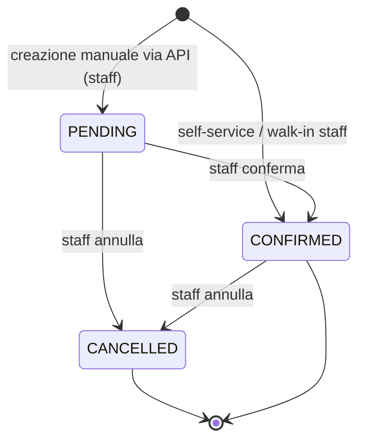
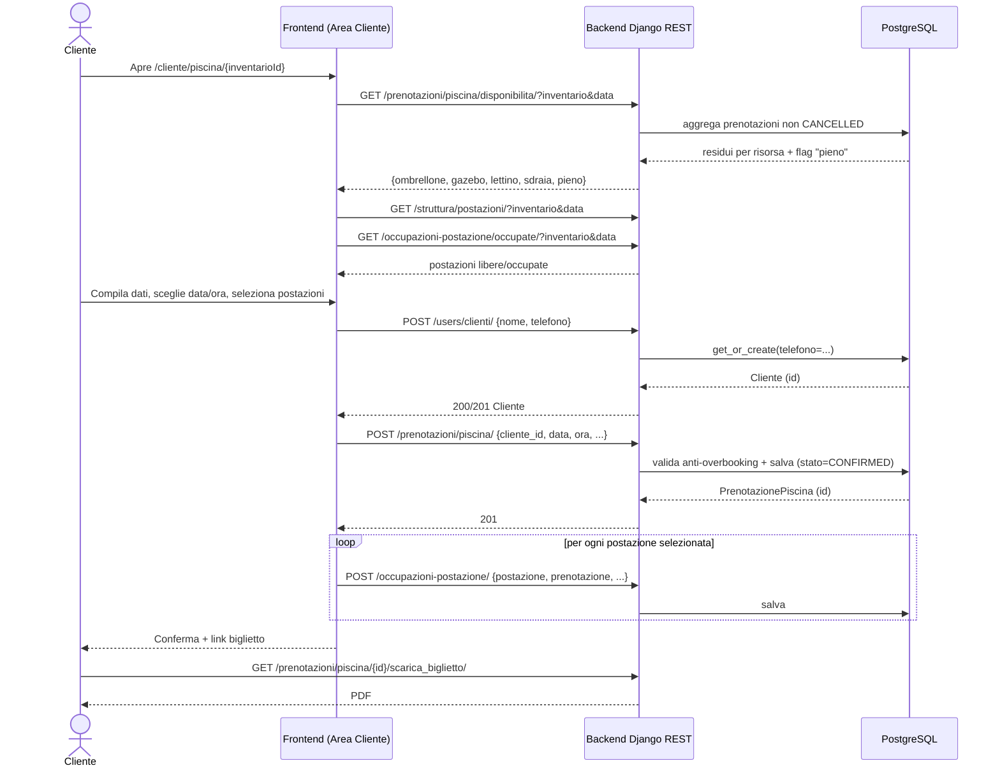
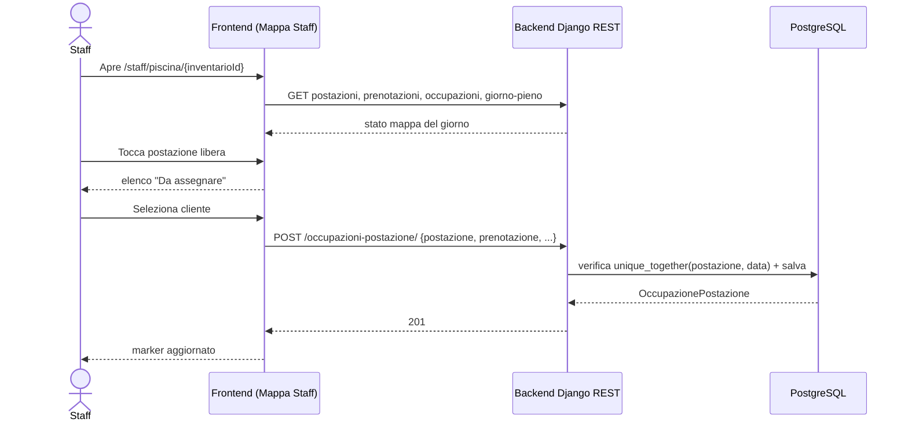
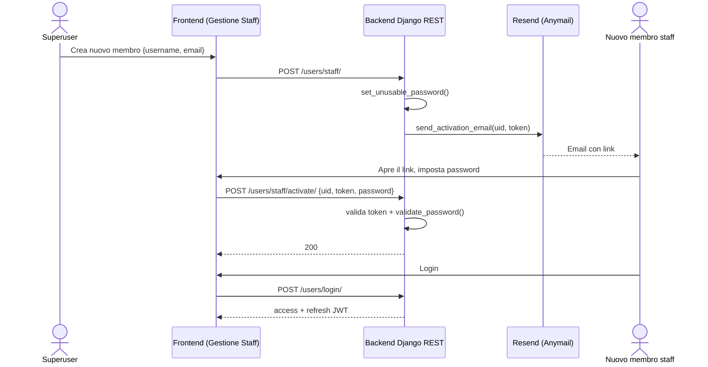
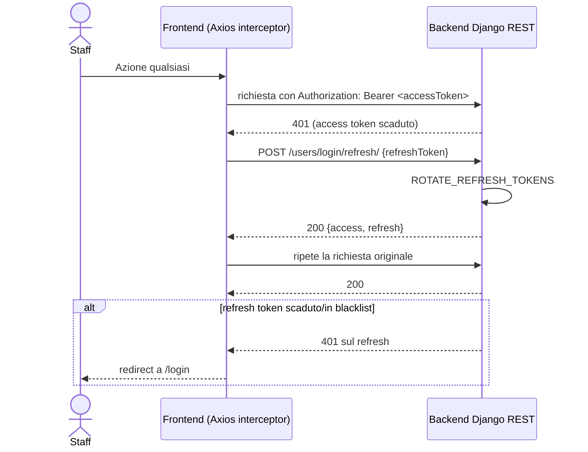

# Documentazione UML — Gestionale Le Gole

## Indice

1. [Panoramica architetturale](#1-panoramica-architetturale)
2. [Diagramma dei casi d'uso](#2-diagramma-dei-casi-duso)
3. [Diagramma delle classi — dominio applicativo](#3-diagramma-delle-classi--dominio-applicativo)
4. [Diagramma di stato — ciclo di vita `Prenotazione`](#4-diagramma-di-stato--ciclo-di-vita-prenotazione)
5. [Diagrammi di sequenza](#5-diagrammi-di-sequenza)
   - [5.1 Prenotazione self-service (Area Cliente)](#51-prenotazione-self-service-area-cliente)
   - [5.2 Assegnazione postazione dalla mappa staff](#52-assegnazione-postazione-dalla-mappa-staff)
   - [5.3 Invito e attivazione account staff](#53-invito-e-attivazione-account-staff)
   - [5.4 Refresh automatico del token JWT](#54-refresh-automatico-del-token-jwt)
6. [Moduli futuri](#6-moduli-futuri)

---

## 1. Panoramica architetturale

---

## 2. Diagramma dei casi d'uso

---

## 3. Diagramma delle classi — dominio applicativo

| Modello | Vincolo |
|---|---|
| `Postazione` | `UniqueConstraint(inventario, numero)` condizionato a `deleted_at IS NULL` |
| `OccupazionePostazione` | `unique_together(postazione, data)` |
| `GiornoPienoPiscina` | `unique_together(inventario, data)` |
| `PostazionePosizioneStorico` | `unique_together(postazione, data)` |
| `PrenotazionePiscina.inventario` | `on_delete=PROTECT` |
| `Cliente.telefono` | unicità solo applicativa (`get_or_create`) |
| `Utente.email` | unicità solo applicativa (`email__iexact`) |
| `Postazione.gruppo` | `UUIDField` non-FK, chiave di raggruppamento |

---

## 4. Diagramma di stato — ciclo di vita `Prenotazione`

---

## 5. Diagrammi di sequenza

### 5.1 Prenotazione self-service (Area Cliente)

### 5.2 Assegnazione postazione dalla mappa staff

### 5.3 Invito e attivazione account staff

### 5.4 Refresh automatico del token JWT

---

## 6. Moduli futuri

| App | Modelli pianificati |
|---|---|
| `struttura` | `Sala`, `Tavolo` |
| `prenotazioni` | `Prenotazione_Tavolo`, `Prenotazione_Asporto` |
| `menu` | `Prodotto`, `Voce_Ordine` |
